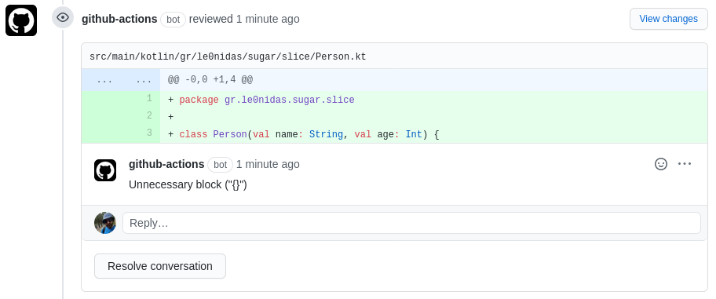

## Ktlint PR comments v1.1

This action runs [ktlint](https://ktlint.github.io/) against all `.kt` files that were changed in a PR
and makes a line comment for every error that ktlint found.

Note that in order to make a comment the error must be in a line that is part of the PR's diff.

## Usage

```yaml
- uses: le0nidas/ktlint-pr-comments@v1.1
  with:
    repotoken: ${{ secrets.GITHUB_TOKEN }}
    disabledrules: "parameter-list-wrapping,final-newline"
```

## Example

The code:
```kotlin
class Person(val name: String, val age: Int) {
}
``` 

will produce the comment:

